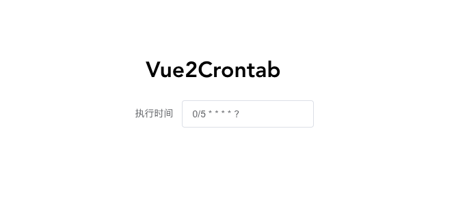
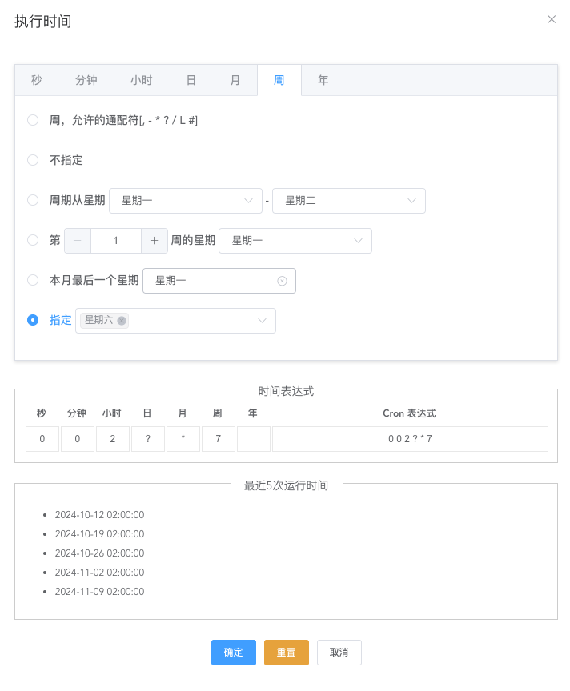

# Vue2Crontab

vue2-crontab

> Support for Vue 2's crontab component.

<p align='center'>
<b>English</b> | <a href="https://github.com/tudan110/vue2-crontab/blob/main/README.zh-CN.md">简体中文</a>
</p>

## Pictures





## Installation

Make sure to install the dependencies first:

```bash
# sh
npm install
```

## Development

Start the development server:

```sh
npm run dev
```

## Build

Build the library for production or publishing:

```sh
npm run lib
```

Build the example project for production or publishing:

```sh
npm run build
```

## Check and Fix Files
```
npm run lint
```

## Publish Package to npm

Log in to the npm registry
```sh
npm login
```

Publish
```sh
npm publish --access public
```

## How to Use the lib File?

### npm Installation

```sh
npm i vue2-crontab
```

### Global Import
Import and register the component in main.js
```js
import Vue from 'vue'
import Vue2Crontab from 'vue2-crontab'

Vue.use(Vue2Crontab)
```

### Manual Import
```js
import Vue2Crontab from 'vue2-crontab'

export default {
    components: {
        Vue2Crontab
    }
}
```

### Without a Build Tool or via `CDN`

```html
<!DOCTYPE html>
<html lang="en">
<head>
    <meta charset="UTF-8" />
    <link rel="icon" href="/favicon.ico" />
    <meta name="viewport" content="width=device-width, initial-scale=1.0" />
    <title>Vite App</title>
    <script src="https://cdn.jsdelivr.net/npm/vue@2"></script>
    <!-- Make sure you have this file in your current directory -->
    <script src="/lib/vue2-crontab.umd.js"></script>
    <style>
        #app {
            font-family: Avenir, Helvetica, Arial, sans-serif;
            -webkit-font-smoothing: antialiased;
            -moz-osx-font-smoothing: grayscale;
            text-align: center;
            color: #2c3e50;
            margin-top: 60px;
        }
    </style>
</head>
<body>
<div id="app">
    <vue2-crontab></vue2-crontab>
</div>
</body>
<script>
    var app = new Vue({
        el: '#app'
    })
</script>
</html>
```

## Demo

```vue
<template>
  <div id="app">

    <div class="container">

      <h1>Vue2Crontab</h1>

      <!-- Form -->
      <el-form :model="form" :inline="true" label-width="110px">
        <el-form-item label="ExecutionTime" prop="cronExpression">
          <el-input
              v-model="form.cronExpression"
              placeholder="please input execution time"
              clearable
              @focus="showCron=true"
          />
        </el-form-item>

      </el-form>

      <!-- cron component -->
      <el-dialog title="ExecutionTime" :visible.sync="showCron">
        <vue2-crontab @hide="showCron=false" @fill="crontabFill" :expression="form.cronExpression"></vue2-crontab>
      </el-dialog>

    </div>

  </div>

</template>

<script>
  export default {
    name: 'App',
    components: {},
    data() {
      return {
        showCron: false,
        form: {
          cronExpression: null,
        }
      }
    },
    methods: {
      crontabFill(value) {
        this.form.cronExpression = value
      },
    }
  }
</script>

<style scoped>
  #app {
    font-family: Avenir, Helvetica, Arial, sans-serif;
    -webkit-font-smoothing: antialiased;
    -moz-osx-font-smoothing: grayscale;
    margin-top: 60px;
  }

  .container {
    display: flex;
    flex-direction: column;
    align-items: center;
    height: 100vh;
  }
</style>
```

## License

Made with ❤️

Published under [MIT License](./LICENSE).
